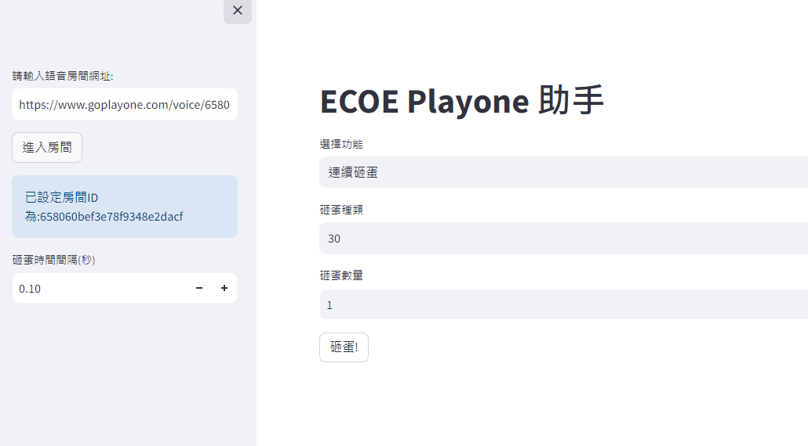
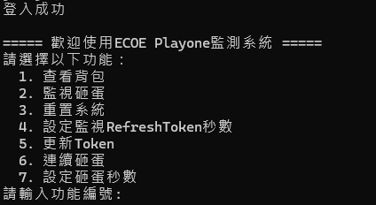
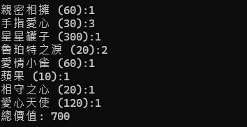
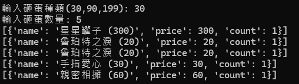
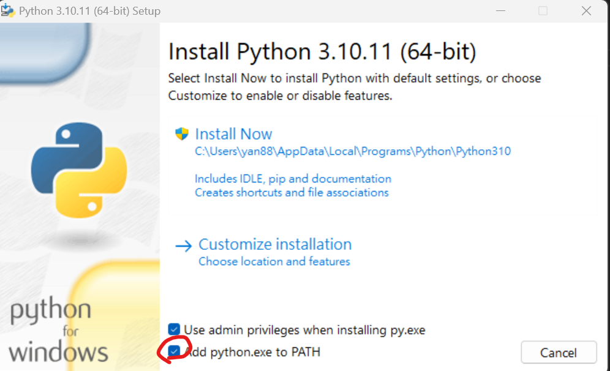
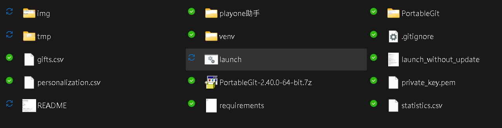
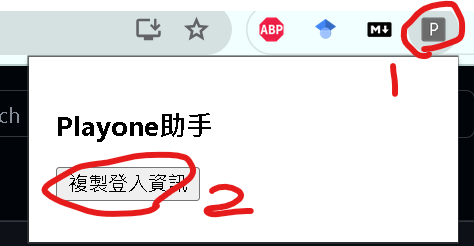

# Playone Monitor
現以支援GUI介面!

使用前請聯絡ecoe以索取金鑰喔!

## 功能

1. 確認背包  

2. 監測砸蛋狀況  
3. 連續砸蛋  

### 安裝
1. 點擊安裝`python-3.10.11-amd64.exe (務必勾選Add python.exe to PATH)

2. 點擊`launch.bat`。如果跳出視窗詢問是否安裝，選OK

(如果跳出藍色方框"Windows已保護您的電腦"，請點選`仍要執行`)
1. 完成後再次點選`launch.bat`，複製機器碼，聯絡ecoe以索取金鑰
2. 關閉視窗，重新點擊`launch.bat`，貼上金鑰，按enter
3. 安裝資料夾中的`playone助手`到chrome (參考: https://www.thesslstore.com/blog/install-a-chrome-extension/)

### 使用方式
1. 開啟瀏覽器，登入欲抽蛋帳號，進入語音房
2. 開啟右上角`Playone助手`插件，點選`複製登入資訊`
3. 點擊資料夾中`launch.bat`，進入GUI介面，登入方式選Token，複製貼上登入資訊

4. 點選功能，如果選擇砸蛋，複製語音房的網址以進入語音房，就可以砸蛋

* 警告：使用者應自行衡量使用風險，ecoe不對本程式造成的可能負面影響負責
